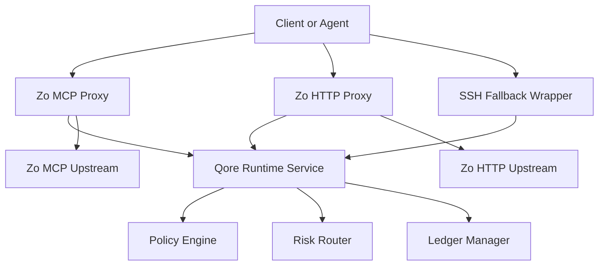

# FailSafe-Qore

FailSafe-Qore is MythologIQ's Zo-native governance runtime.

[](https://nodejs.org)
[](https://www.typescriptlang.org)
[](LICENSE)
[](docs/plan_qore_zo_architecture.md)

## What This Repository Is

FailSafe started as extension-coupled governance logic. `FailSafe-Qore` is the extracted runtime that keeps policy, risk, ledger, and decision contracts independent from IDE hosting concerns.

Repository direction:
- Zo-native design: `implemented` for repository-local scope
- Zo-native implementation layers in this repository: `implemented`
- IDE adapter dependency for core runtime: `deferred`

Architecture source of truth: `docs/plan_qore_zo_architecture.md`

## Core Capabilities

- Runtime policy, risk, and ledger engine: `implemented`
- Decision contracts (`DecisionRequest` and `DecisionResponse`): `implemented`
- Local governance API (`/health`, `/policy/version`, `/evaluate`): `implemented`
- Zo MCP governance proxy: `implemented`
- Zo HTTP `/zo/ask` governance proxy: `implemented`
- Zo SSH fallback wrapper and watcher pipeline: `implemented`
- Zo direct model-policy enforcement (required model + allowlist controls): `implemented`
- Zo model recommendation modes (`manual`, `suggest`, `auto`): `implemented`
- Prompt transparency events for direct Zo dispatch (build and send stages): `implemented`
- Actor proof signing, nonce replay protection, and key rotation tooling: `implemented`
- Release gate and Zo assumption freshness checks: `implemented`

## Architecture at a Glance



Design guardrail: Zo-specific behavior stays in adapter layers under `zo/`. Core policy, risk, ledger, and contracts stay adapter-agnostic.

## Repository Layout

| Path | Purpose |
|---|---|
| `@mythologiq/qore-contracts` | Shared schemas, runtime interfaces, and action classification package |
| `policy/` | Policy engine and policy definitions |
| `risk/` | Evaluation routing, novelty, and cache instrumentation |
| `ledger/` | Append-only ledger and integrity verification |
| `runtime/` | Runtime orchestration and local API service |
| `zo/mcp-proxy/` | MCP governance adapter, forwarding, rate limiting, metrics |
| `zo/http-proxy/` | Zo HTTP governance adapter for `/zo/ask` |
| `zo/fallback/` | SSH fallback governance wrapper, identity, watcher pipeline |
| `deploy/systemd/` | Service templates for runtime and fallback watcher |
| `tests/` | Unit and integration validation |
| `docs/` | Phase plans, adversarial reviews, and substantiation artifacts |

## Quick Start

1. Install dependencies:
```bash
npm ci
```
2. Run baseline validation:
```bash
npm run typecheck
npm test
npm run lint
npm run build
```
3. Run full release gate:
```bash
npm run release:gate
```

## Run Local Runtime API

Build first, then start the runtime service:

```bash
npm run build
```

```powershell
$env:QORE_API_KEY="change-me"
node dist/runtime/service/start.js
```

Example evaluation call:

```bash
curl -X POST http://127.0.0.1:7777/evaluate \
  -H "content-type: application/json" \
  -H "x-qore-api-key: change-me" \
  -d '{
    "requestId":"req-1",
    "actorId":"did:myth:test:actor",
    "action":"read",
    "targetPath":"repo://docs/plan_qore_zo_architecture.md"
  }'
```

## Operational Tooling

- Rotate actor keys:
```bash
npm run keys:rotate
```
- Verify Zo assumption evidence freshness:
```bash
npm run assumptions:check
```
- Start fallback watcher from built output:
```bash
node dist/zo/fallback/start-watcher.js
```

## UI Transparency Contract

Your existing intent package output area is sufficient if it renders prompt-transparency payloads.
Use `runtime/api/PromptTransparencyView.ts` to map ledger payloads (`type: prompt_transparency`) into a stable UI view model.

Model selection behavior for Zo direct mode:
- `manual`: use provided model only.
- `suggest`: preserve provided model and emit recommendation metadata.
- `auto`: select model automatically from catalog and attach a warning banner.

Recommendation metadata includes token-efficiency and cost-savings signals:
- estimated input and output tokens
- estimated selected-model cost
- baseline-model cost
- projected cost saved (USD and percent)
- token utilization percent

These values are exposed for both Zo and extension surfaces through runtime API exports (`recommendModel`, `ZoModelSelectionResult`) and Zo response headers (`x-qore-model-*`).

## Zo Install and Bootstrap

Recommended path is direct pull on Zo host after this repository is pushed:

```bash
sudo bash deploy/zo/take-this-and-go.sh
```

Bootstrap script:
- pulls repository from GitHub
- installs dependencies
- builds runtime
- installs and starts systemd services
- creates `/etc/failsafe-qore/env` from `deploy/zo/env.example`

Optional upload bundle path from Windows:

```powershell
npm run zo:bundle
```

Then upload `dist/failsafe-qore-zo-bundle.tgz` to Zo and extract under `/opt/failsafe-qore` before running `deploy/zo/bootstrap-zo.sh`.

Quick handoff doc: `deploy/zo/TAKE_THIS_AND_GO.md`.

## Controlled Release

Create versioned release artifacts locally:

```bash
npm run release:artifacts
```

Output:
- `dist/release/vX.Y.Z/failsafe-qore-zo-bundle-vX.Y.Z.tgz`
- `dist/release/vX.Y.Z/SHA256SUMS`
- `dist/release/vX.Y.Z/TAKE_THIS_AND_GO.md`
- `dist/release/vX.Y.Z/RELEASE_NOTES.md`

Verify before install:

```bash
sha256sum -c SHA256SUMS
```

Tag push (`v*`) also triggers GitHub release artifact publishing via `.github/workflows/release-artifacts.yml`.

## Documentation Map

- Architecture plan: `docs/plan_qore_zo_architecture.md`
- Assumption gates: `docs/ZO_ASSUMPTIONS_AND_GATES.md`
- Zo public skills policy: `docs/ZO_PUBLIC_SKILLS_REFERENCE.md`
- Documentation status map: `docs/DOCUMENTATION_STATUS.md`
- Bootstrap checks: `docs/BOOTSTRAP_CHECKLIST.md`
- Phase 4 substantiation: `docs/phase4_substantiation.md`
- Phase 5 substantiation: `docs/phase5_substantiation.md`
- Phases 6-9 adversarial record: `docs/adversarial_review_phase6_phase9.md`
- Full docs index: `docs/README.md`

## Claim-to-Source Map

| Claim | Status | Source |
|---|---|---|
| Runtime coordinator exists | `implemented` | `runtime/service/QoreRuntimeService.ts:23` |
| Local API enforces API key by default | `implemented` | `runtime/service/LocalApiServer.ts:25` |
| Contract package is externalized and consumed as dependency | `implemented` | `package.json:28` |
| Zo MCP proxy enforces signed actor context | `implemented` | `zo/mcp-proxy/server.ts:170` |
| Zo HTTP proxy implements policy preflight for `/zo/ask` | `implemented` | `zo/http-proxy/server.ts:62` |
| Zo direct adapters enforce model policy before dispatch | `implemented` | `zo/http-proxy/server.ts:317`, `zo/mcp-proxy/server.ts:566` |
| Prompt transparency events are emitted for build/dispatch stages | `implemented` | `zo/prompt-transparency.ts:1`, `zo/http-proxy/server.ts:342`, `zo/mcp-proxy/server.ts:591` |
| Replay protection supports SQLite shared strategy | `implemented` | `zo/security/replay-store.ts:70` |
| Release gate script runs typecheck, lint, test, build, assumptions check | `implemented` | `scripts/release-gate.mjs:4` |
| CI includes baseline checks and release-readiness workflow | `implemented` | `.github/workflows/ci.yml:1`, `.github/workflows/release-readiness.yml:1` |

## License

MIT. See `LICENSE`.
