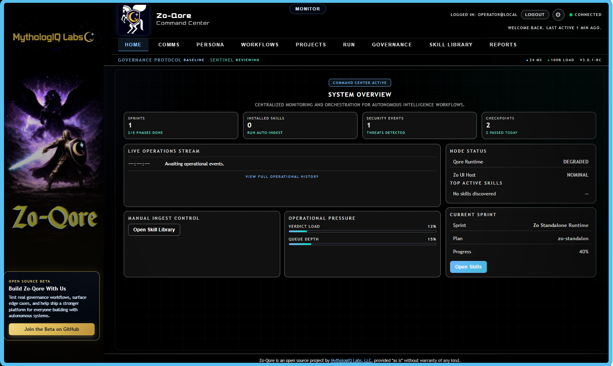
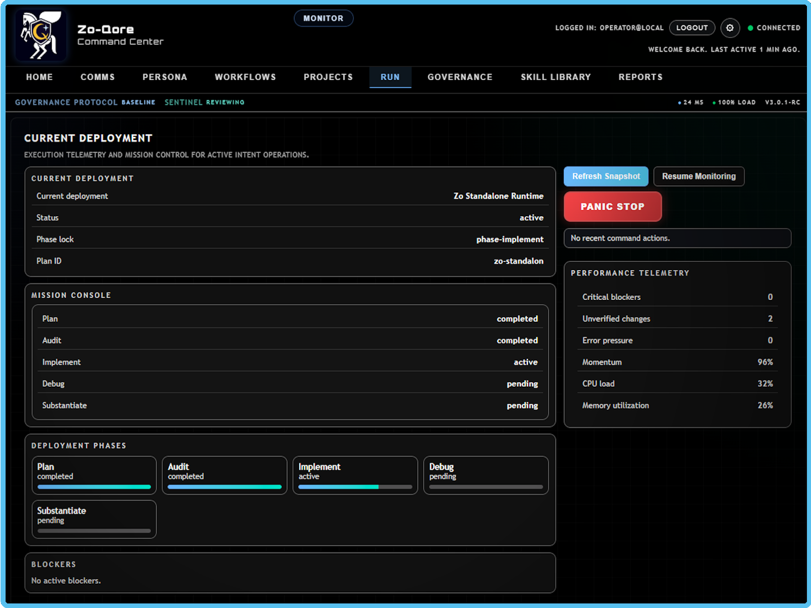
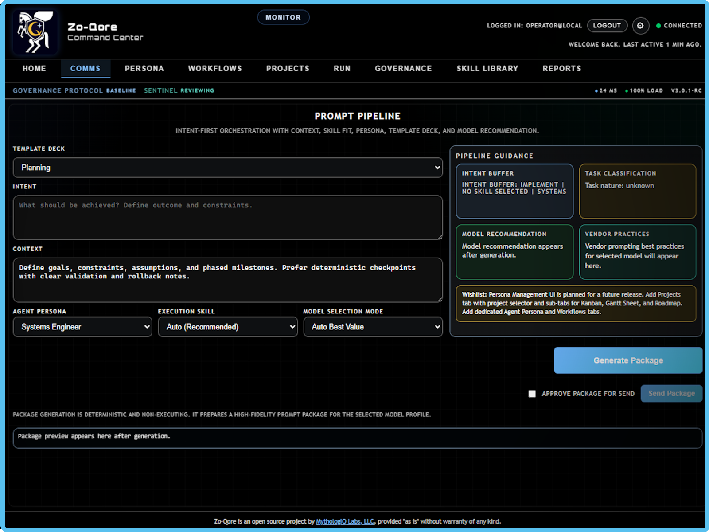
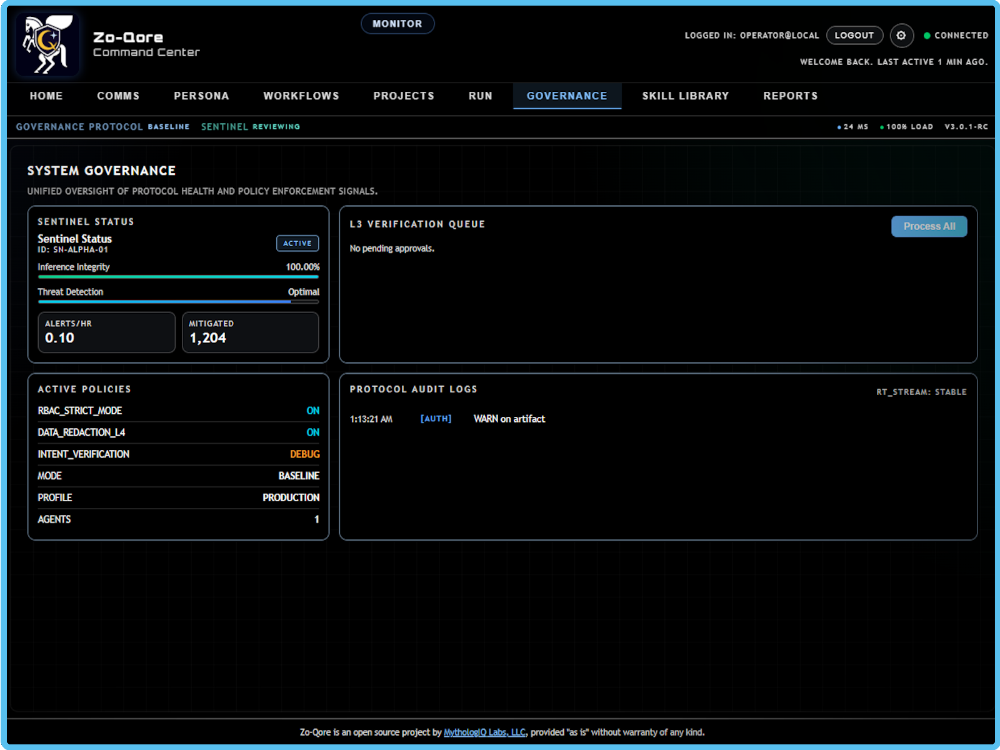
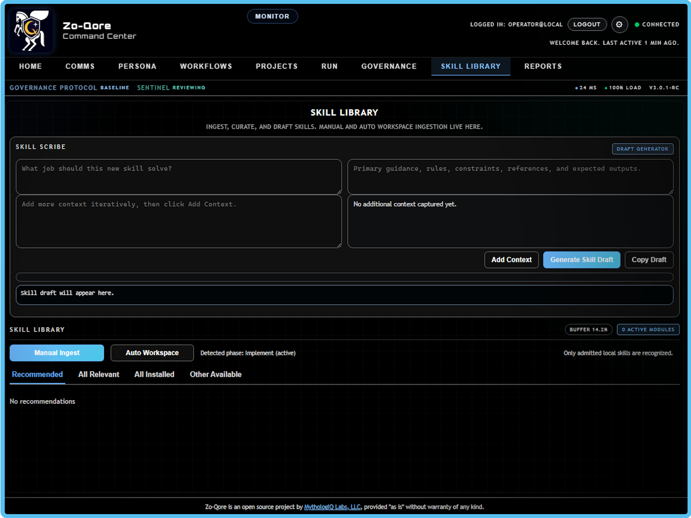
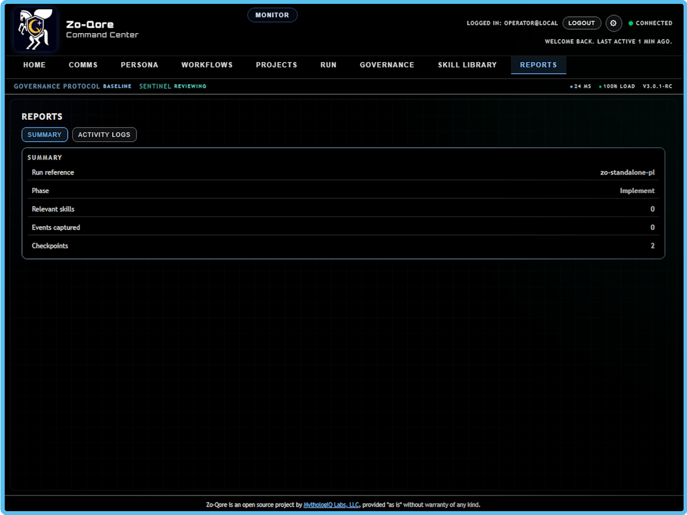
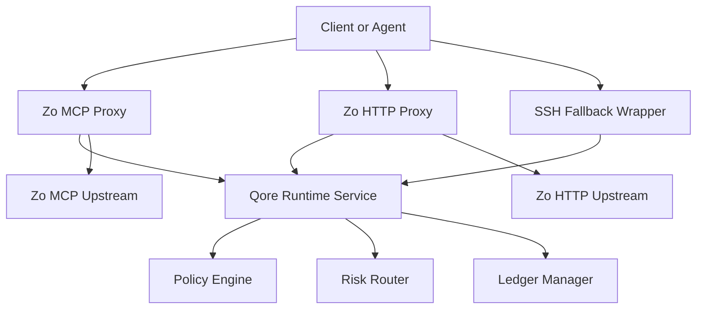

# Zo-Qore

Zo-Qore is MythologIQ's Zo-native governance runtime.
Current release: `Zo-Qore 1.0.0` (2026-02-13).

## Here's how you can get started with Zo-Qore.

1. Create a Zo account: https://zo.computer?referrer=frostwulf
2. Use a paid Zo tier for full hosted setup (runtime + UI requires at least 2 services).
3. Run the installer:

```bash
git clone https://github.com/MythologIQ/failsafe-qore.git Zo-Qore
cd Zo-Qore
bash deploy/zo/install-zo-full.sh
```

If you are on Zo free tier (single service), use local/process mode:

```bash
npm ci
export QORE_API_KEY="replace-with-strong-secret"
npm run zo:one-click
```

[](https://nodejs.org)
[](https://www.typescriptlang.org)
[](LICENSE)
[](docs/plan_qore_zo_architecture.md)

## Start Here (Executable Setup)

If you are a new user, use this first.

### Zo install (recommended)

```bash
git clone https://github.com/MythologIQ/failsafe-qore.git Zo-Qore
cd Zo-Qore
bash deploy/zo/install-zo-full.sh
```

This provisions runtime + UI, security defaults, and service registration. If `register_user_service` is not available in your Zo environment, the installer will provide a prompt to copy and paste into your Zo native AI to complete service registration.
In that handoff path, generated secrets are written to `./.failsafe/zo-native-ai.env` (mode `0600`) and referenced by the prompt via `source` instead of being printed in plaintext.

Installer prompt behavior (`implemented`):

- The installer runs in interactive mode by default.
- For prompts like `Repository URL [https://github.com/MythologIQ/failsafe-qore.git]:`, press `Enter` to accept the default.
- Use `bash deploy/zo/install-zo-full.sh --non-interactive` for automation with no prompts.
- In interactive mode, sensitive secrets rotate by default and are not preserved from prior shell environment values.
- Config file output is opt-in via `--write-config <path>` because it stores resolved secrets.
- After Zo native AI handoff succeeds, remove `./.failsafe/zo-native-ai.env` and rotate credentials if setup logs were captured.

### Public one-line install (download + run)

```bash
curl -fsSL https://raw.githubusercontent.com/MythologIQ/failsafe-qore/main/deploy/zo/install-zo-full.sh | bash
```

Windows PowerShell:

```powershell
iwr -useb https://raw.githubusercontent.com/MythologIQ/failsafe-qore/main/deploy/zo/install-zo-full.sh | bash
```

### Local run (no Zo service registration)

```bash
npm ci
export QORE_API_KEY="replace-with-strong-secret"
npm run zo:one-click
```

Open:

- `http://127.0.0.1:9380/ui/console`
- `http://127.0.0.1:9380/ui/monitor`

### Update / uninstall

```bash
npm run zo:update
npm run zo:uninstall
```

Need test cleanup from early safe bootstrap:

```bash
npm run zo:uninstall:legacy-test
```

For step-by-step install troubleshooting:

- `deploy/zo/TAKE_THIS_AND_GO.md`

## Screenshots

### Branding


### Product Views








## What This Repository Is

FailSafe started as extension-coupled governance logic. `FailSafe-Qore` is the extracted runtime that keeps policy, risk, ledger, and decision contracts independent from IDE hosting concerns.

Repository direction:

- Zo-native design: `implemented` for repository-local scope
- Zo-native implementation layers in this repository: `implemented`
- IDE adapter dependency for core runtime: `deferred`
- UI strategy: `diverging` (Zo-Qore UI maintained as separate track; QoreLogic remains universal)

Architecture source of truth: `docs/plan_qore_zo_architecture.md`

## Zo-Qore Intent

Zo-Qore is the Zo-native operating surface for QoreLogic. The intent is straightforward:

- keep governance enforcement visible and auditable
- keep prompt construction explicit instead of hidden automation
- keep the runtime contract stable across Zo and local IDE adapter paths

If you are testing or contributing, thank you. This is a fully open source community project and your feedback directly improves security, reliability, and usability for everyone.

## Core Capabilities

- Runtime policy, risk, and ledger engine: `implemented`
- Decision contracts (`DecisionRequest` and `DecisionResponse`): `implemented`
- Local governance API (`/health`, `/policy/version`, `/evaluate`): `implemented`
- Zo MCP governance proxy: `implemented`
- Zo HTTP `/zo/ask` governance proxy: `implemented`
- Zo SSH fallback wrapper and watcher pipeline: `implemented`
- Zo direct model-policy enforcement (required model + allowlist controls): `implemented`
- Zo model recommendation modes (`manual`, `suggest`, `auto`): `implemented`
- Prompt transparency events for direct Zo dispatch (build and send stages): `implemented`
- Actor proof signing, nonce replay protection, and key rotation tooling: `implemented`
- Release gate and Zo assumption freshness checks: `implemented`

## Architecture at a Glance



Design guardrail: Zo-specific behavior stays in adapter layers under `zo/`. Core policy, risk, ledger, and contracts stay adapter-agnostic.

## Repository Layout

| Path                         | Purpose                                                               |
| ---------------------------- | --------------------------------------------------------------------- |
| `@mythologiq/qore-contracts` | Shared schemas, runtime interfaces, and action classification package |
| `policy/`                    | Policy engine and policy definitions                                  |
| `risk/`                      | Evaluation routing, novelty, and cache instrumentation                |
| `ledger/`                    | Append-only ledger and integrity verification                         |
| `runtime/`                   | Runtime orchestration and local API service                           |
| `zo/mcp-proxy/`              | MCP governance adapter, forwarding, rate limiting, metrics            |
| `zo/http-proxy/`             | Zo HTTP governance adapter for `/zo/ask`                              |
| `zo/fallback/`               | SSH fallback governance wrapper, identity, watcher pipeline           |
| `deploy/systemd/`            | Service templates for runtime and fallback watcher                    |
| `tests/`                     | Unit and integration validation                                       |
| `docs/`                      | Phase plans, adversarial reviews, and substantiation artifacts        |
| `PRIVATE/`                   | Local-only isolated workspace artifacts (`docs`, `scripts`, `tests`)  |

## Quick Start

1. Install dependencies:

```bash
npm ci
```

2. Run baseline validation:

```bash
npm run typecheck
npm test
npm run lint
npm run build
```

3. Run full release gate:

```bash
npm run release:gate
```

## Run Local Runtime API

Build first, then start the runtime service:

```bash
npm run build
```

```powershell
$env:QORE_API_KEY="change-me"
node dist/runtime/service/start.js
```

Runtime auth controls:

- `QORE_API_KEY` (required when auth is enabled; default runtime mode)
- `QORE_API_PUBLIC_HEALTH` (default `false`; when `true`, `/health` is public while other runtime endpoints still require API key)

Example evaluation call:

```bash
curl -X POST http://127.0.0.1:7777/evaluate \
  -H "content-type: application/json" \
  -H "x-qore-api-key: change-me" \
  -d '{
    "requestId":"req-1",
    "actorId":"did:myth:test:actor",
    "action":"read",
    "targetPath":"repo://docs/plan_qore_zo_architecture.md"
  }'
```

## Standalone UI (No IDE Required)

FailSafe-Qore can host a dedicated Zo UI surface. QoreLogic policy, risk, ledger, and runtime contracts remain universal and shared across all UI surfaces.

Adapter continuity:

- Zo-Qore UI: independent product UI track.
- FailSafe local IDE node: supported adapter path to local IDE workflows.
- Both surfaces must consume the same runtime contract and decision schema.

1. Start runtime API:

```bash
node dist/runtime/service/start.js
```

2. Sync canonical UI assets from `MythologIQ/failsafe`:

```bash
npm run ui:sync
```

3. Start standalone UI in another terminal:

```bash
node dist/zo/ui-shell/start.js
```

4. Open:

```text
http://127.0.0.1:9380
```

UI env controls:

- `QORE_UI_HOST` (default `127.0.0.1`)
- `QORE_UI_PORT` (default `9380`)
- `QORE_RUNTIME_BASE_URL` (default `http://127.0.0.1:${QORE_API_PORT|7777}`)
- `QORE_UI_TIMEOUT_MS` (default `5000`)
- `QORE_UI_ASSETS_DIR` (default auto-detect, prefers `zo/ui-shell/shared`)
- `QORE_UI_ALLOWED_IPS` (optional comma-separated IP allowlist)
- `QORE_UI_TRUST_PROXY_HEADERS` (default `false`; set `true` only behind trusted reverse proxy)
- `QORE_UI_AUTH_MAX_FAILURES` and `QORE_UI_AUTH_LOCKOUT_MS` (Basic Auth lockout controls)
- `QORE_UI_MFA_MAX_FAILURES` and `QORE_UI_MFA_LOCKOUT_MS` (MFA lockout controls)
- `QORE_UI_REQUIRE_ADMIN_TOKEN` (default `true` on public bind `0.0.0.0`)
- `QORE_UI_ADMIN_TOKEN` (required when admin token mode is enabled)

One-command local stack (runtime + UI):

```bash
npm run zo:one-click
```

By default, `/` serves the full extension UI. For the compact diagnostic shell, use `/?ui=compact`.

Stable UI routes:

- Full console: `/ui/console`
- Monitor view: `/ui/monitor`
- Route discovery: `/api/ui/routes`

IDE Web Panel/Sidebar profile:

- Use monitor route in the panel URL: `http://127.0.0.1:9380/ui/monitor`
- For iframe/webview embedding, set:
  - `QORE_UI_ALLOW_FRAME_EMBED=true`
  - `QORE_UI_FRAME_ANCESTORS="'self' https://*.vscode-cdn.net vscode-webview:"`
- Default remains secure (`x-frame-options: DENY`) when embed mode is not enabled.

Stop:

```bash
npm run zo:stop
```

## Operational Tooling

- Rotate actor keys:

```bash
npm run keys:rotate
```

- Verify Zo assumption evidence freshness:

```bash
npm run assumptions:check
```

- Start fallback watcher from built output:

```bash
node dist/zo/fallback/start-watcher.js
```

## UI Transparency Contract

Your existing intent package output area is sufficient if it renders prompt-transparency payloads.
Use `runtime/api/PromptTransparencyView.ts` to map ledger payloads (`type: prompt_transparency`) into a stable UI view model.

Model selection behavior for Zo direct mode:

- `manual`: use provided model only.
- `suggest`: preserve provided model and emit recommendation metadata.
- `auto`: select model automatically from catalog and attach a warning banner.

Recommendation metadata includes token-efficiency and cost-savings signals:

- estimated input and output tokens
- estimated selected-model cost
- baseline-model cost
- projected cost saved (USD and percent)
- token utilization percent

These values are exposed for both Zo and extension surfaces through runtime API exports (`recommendModel`, `ZoModelSelectionResult`) and Zo response headers (`x-qore-model-*`).

## Zo Install and Bootstrap

Use one of these paths depending on host type:

- Zo workspace host (no systemd): use Zo user service registration.
- Standard Linux VM with systemd: use bootstrap service scripts.

Zo user service path (recommended on Zo):

```bash
export QORE_UI_BASIC_AUTH_USER="admin"
export QORE_UI_BASIC_AUTH_PASS="change-this-password"
eval "$(npm run -s ui:mfa:secret | grep '^QORE_UI_TOTP_SECRET=')"
npm ci
npm run build
bash deploy/zo/one-click-services.sh
```

Single-file Zo/Linux installer (recommended for distribution):

```bash
bash deploy/zo/install-zo-full.sh
```

This installer is Zo-specific and will:

- clone/update repository
- install dependencies
- sync full shared UI
- build runtime and UI host
- generate missing API/Auth/MFA/Admin secrets
- register `qore-runtime` and `qore-ui` user services (if available)
- **provide Zo Native AI handoff prompt** if `register_user_service` is unavailable

**Note:** Some Zo environments may not have user service registration enabled due to security restrictions or permission settings. The installer provides a prompt that you can copy and paste into your Zo native AI to complete service registration. Alternatively, you can use standalone mode which runs services as background processes (no auto-restart on Zo reboot).

Installer options:

- `--non-interactive` for automation mode
- `--config <path>` to load predefined values
- `--write-config <path>` to persist resolved values
- `--force-reconfigure` to recreate existing service labels

Update path (after initial install):

```bash
npm run zo:update:dry-run
npm run zo:update
```

Uninstall path:

```bash
npm run zo:uninstall
```

Remove legacy first-test bootstrap artifacts as well:

```bash
npm run zo:uninstall:legacy-test
```

Updater behavior:

- fetches latest `origin/main`
- snapshots runtime state under `.failsafe/backups`
- applies fast-forward update
- runs verification gates (`typecheck`, `test`, `lint`, `build`)
- re-registers services
- rolls back to previous commit and state snapshot on failure

Optional scheduled auto-update:

```bash
npm run zo:update:install-cron
```

Custom schedule example (daily at 03:17 UTC):

```bash
SCHEDULE="17 3 * * *" npm run zo:update:install-cron
```

Remove scheduled update:

```bash
npm run zo:update:remove-cron
```

Manual Zo service registration equivalent:

```bash
register_user_service \
  --label "qore-runtime" \
  --protocol "http" \
  --local-port 7777 \
  --workdir "/home/workspace/MythologIQ/Zo-Qore" \
  --entrypoint "node dist/runtime/service/start.js" \
  --env-vars "QORE_API_HOST=0.0.0.0,QORE_API_PORT=7777"

register_user_service \
  --label "qore-ui" \
  --protocol "http" \
  --local-port 9380 \
  --workdir "/home/workspace/MythologIQ/Zo-Qore" \
  --entrypoint "node dist/zo/ui-shell/start.js" \
  --env-vars "QORE_UI_HOST=0.0.0.0,QORE_UI_PORT=9380,QORE_RUNTIME_BASE_URL=http://127.0.0.1:7777,QORE_UI_ASSETS_DIR=/home/workspace/MythologIQ/Zo-Qore/zo/ui-shell/shared,QORE_UI_REQUIRE_AUTH=true,QORE_UI_REQUIRE_MFA=true,QORE_UI_BASIC_AUTH_USER=admin,QORE_UI_BASIC_AUTH_PASS=change-this-password,QORE_UI_TOTP_SECRET=replace-with-base32-secret,QORE_UI_ADMIN_TOKEN=replace-with-admin-token"
```

MFA bootstrap:

- Run `npm run ui:mfa:secret` and copy `OTPAuthURL` into your authenticator app (1Password, Authy, Google Authenticator, iOS Passwords).
- Login flow becomes: Basic Auth (username/password), then TOTP step at `/mfa`.
- Security admin endpoints:
  - `GET /api/admin/security` (auth posture and active session count)
  - `GET /api/admin/sessions` (active MFA session inventory)
  - `GET /api/admin/devices` (grouped device/session inventory)
  - `POST /api/admin/sessions/revoke` with `{ "all": true }`, `{ "sessionId": "<tokenId>" }`, or `{ "deviceId": "<deviceId>" }`
  - `POST /api/admin/mfa/recovery/reset` with `{ "confirm": "RESET_MFA" }` (rotate TOTP secret and revoke all sessions)

Control-plane baseline (`qorectl`):

- `npm run qorectl:doctor`
- `npm run qorectl:sessions`
- `npm run qorectl:devices`
- `npm run qorectl:revoke-all-sessions`
- `npm run qorectl:mfa-reset`
- `QORE_UI_ADMIN_TOKEN` is required for session revocation automation.

Resilience operations:

- `npm run zo:backup` to snapshot ledger/replay/auth installer state under `.failsafe/backups/`
- `npm run zo:backups` to list available snapshots
- `npm run zo:restore:dry-run -- --from <backupDir>` to validate restore inputs
- `node scripts/zo-resilience.mjs restore --from <backupDir> --confirm RESTORE` to apply restore
- `npm run zo:update:dry-run` to check if upstream update is available
- `npm run zo:update` to apply rollback-safe repository update

Systemd bootstrap path (non-Zo Linux hosts):

```bash
sudo bash deploy/zo/take-this-and-go.sh
```

Bootstrap script:

- pulls repository from GitHub
- installs dependencies
- builds runtime
- installs and starts systemd services
- creates `/etc/failsafe-qore/env` from `deploy/zo/env.example`

Optional upload bundle path from Windows:

```powershell
npm run zo:bundle
```

Then upload `dist/failsafe-qore-zo-bundle.tgz` to Zo and extract under `/opt/failsafe-qore` before running `deploy/zo/bootstrap-zo.sh`.

Quick handoff doc: `deploy/zo/TAKE_THIS_AND_GO.md`.
Agent-assisted setup prompt: `deploy/zo/AGENT_SETUP_PROMPT.md`.

## Controlled Release

Create versioned release artifacts locally:

```bash
npm run release:artifacts
```

Output:

- `dist/release/vX.Y.Z/failsafe-qore-zo-bundle-vX.Y.Z.tgz`
- `dist/release/vX.Y.Z/SHA256SUMS`
- `dist/release/vX.Y.Z/TAKE_THIS_AND_GO.md`
- `dist/release/vX.Y.Z/RELEASE_NOTES.md`

Verify before install:

```bash
sha256sum -c SHA256SUMS
```

Tag push (`v*`) also triggers GitHub release artifact publishing via `.github/workflows/release-artifacts.yml`.

## Documentation Map

- Architecture plan: `docs/plan_qore_zo_architecture.md`
- Comprehensive walkthrough and appendix: `docs/ZOQORE_WALKTHROUGH.md`
- Zo-Qore intent and contributor note: `docs/ZOQORE_INTENT.md`
- Assumption gates: `docs/ZO_ASSUMPTIONS_AND_GATES.md`
- Zo public skills policy: `docs/ZO_PUBLIC_SKILLS_REFERENCE.md`
- Documentation status map: `docs/DOCUMENTATION_STATUS.md`
- Bootstrap checks: `docs/BOOTSTRAP_CHECKLIST.md`
- Phase 4 substantiation: `docs/phase4_substantiation.md`
- Phase 5 substantiation: `docs/phase5_substantiation.md`
- Phases 6-9 adversarial record: `docs/adversarial_review_phase6_phase9.md`
- Local IDE adapter contract: `docs/LOCAL_IDE_ADAPTER_CONTRACT.md`
- Adapter compatibility checklist: `docs/ADAPTER_COMPATIBILITY_CHECKLIST.md`
- Full docs index: `docs/README.md`
- Release history: `CHANGELOG.md`

## Claim-to-Source Map

| Claim                                                                    | Status        | Source                                                                                     |
| ------------------------------------------------------------------------ | ------------- | ------------------------------------------------------------------------------------------ |
| Runtime coordinator exists                                               | `implemented` | `runtime/service/QoreRuntimeService.ts:23`                                                 |
| Local API enforces API key by default                                    | `implemented` | `runtime/service/LocalApiServer.ts:25`                                                     |
| Contract package is externalized and consumed as dependency              | `implemented` | `package.json:28`                                                                          |
| Zo MCP proxy enforces signed actor context                               | `implemented` | `zo/mcp-proxy/server.ts:170`                                                               |
| Zo HTTP proxy implements policy preflight for `/zo/ask`                  | `implemented` | `zo/http-proxy/server.ts:62`                                                               |
| Zo direct adapters enforce model policy before dispatch                  | `implemented` | `zo/http-proxy/server.ts:317`, `zo/mcp-proxy/server.ts:566`                                |
| Prompt transparency events are emitted for build/dispatch stages         | `implemented` | `zo/prompt-transparency.ts:1`, `zo/http-proxy/server.ts:342`, `zo/mcp-proxy/server.ts:591` |
| Replay protection supports SQLite shared strategy                        | `implemented` | `zo/security/replay-store.ts:70`                                                           |
| Release gate script runs typecheck, lint, test, build, assumptions check | `implemented` | `scripts/release-gate.mjs:4`                                                               |
| CI includes baseline checks and release-readiness workflow               | `implemented` | `.github/workflows/ci.yml:1`, `.github/workflows/release-readiness.yml:1`                  |

## License

MIT. See `LICENSE`.
